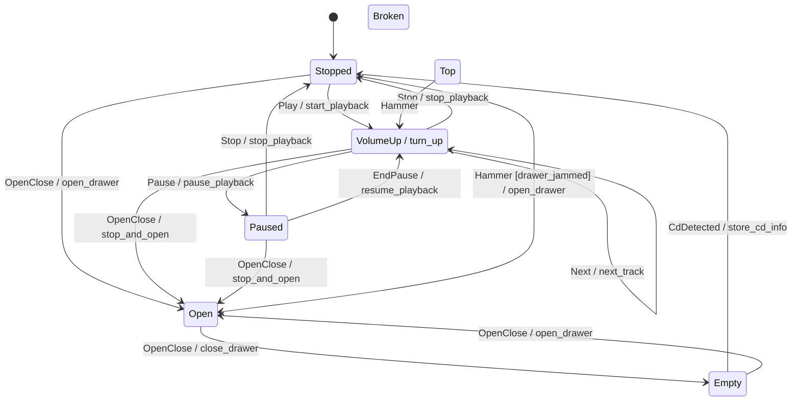

# eta-hsm

[](https://github.com/r4stered/eta-hsm/actions/workflows/linux.yml)
[](https://github.com/r4stered/eta-hsm/actions/workflows/linux.yml)

A header-only C++ library for **hierarchical state machines** (HSMs).

> **v2 is a clean break.** Built on **C++26** reflection (P2996), targets
> **GCC 16+**, and drops the `wise_enum` dependency. The v1 CRTP API is not part
> of v2 — see [Using v1](#using-v1).

## At a glance

[Compiler Explorer demo.](https://godbolt.org/z/MeT87Eq5a) A whole machine is one
`constexpr` table — States with their parent, the Top State's Initial Substate,
and flat `(Source, Event, Target [, Action])` rows. No handler `switch` bodies,
no per-State classes: the topology is data. Entry/Exit hooks and Actions are
ordinary Host members, matched **by name via reflection**, so you write only the
ones you need.

```cpp
#include <cassert>
#include "eta_hsm/machine/hsm.hpp"
#include "eta_hsm/machine/machine.hpp"

using namespace eta_hsm;

enum class State { Top, Stopped, Playing };
enum class Event { Play, Stop };

// The Host owns no machine state; it supplies Actions and per-State hooks.
struct Player {
    int plays = 0;
    void start() { ++plays; }   // an Action, run on a Transition
    void entry_Playing() {}      // a per-State Entry hook, found by reflection
};

// Single source of truth. State enum deduced from the first `.state`, Event enum
// from the first `.on`.
inline constexpr auto player = Hsm<Player>{}
                                   .state(State::Stopped, State::Top)
                                   .state(State::Playing, State::Top)
                                   .initial(State::Top, State::Stopped)
                                   .on(State::Stopped, Event::Play, State::Playing, &Player::start)
                                   .on(State::Playing, Event::Stop, State::Stopped);

int main()
{
    Machine<player> m;            // validated at compile time; rests in Stopped
    m.dispatch(Event::Play);      // Stopped -> Playing, runs start()
    assert(m.identify() == State::Playing);
    assert(m.host().plays == 1);
}
```

The same table drives the machine, the compile-time [validator](#testing), and
the [diagram emitter](#diagrams) — one definition, three consumers, no drift. The
core has no vtable and no heap on the event path (see [Performance](#performance)).

## Features

Each feature has a complete, self-contained example under
[`eta_hsm/examples/`](eta_hsm/examples) that builds against the real headers via
`./docker_build`.

- **Guards** — a Transition row can carry a `bool (Host::*)() const` predicate as
  the last `.on(...)` argument; the row fires only when it returns true, otherwise
  the Event keeps deferring up the parent chain.
- **Hierarchy** — States nest: each names its parent, each Composite names its
  Initial Substate. Construction drills Top → Leaf firing Entry hooks top-down; an
  unhandled Event defers up to the nearest ancestor that handles it; a Transition
  fires Exit hooks bottom-up then Entry hooks top-down with the Action in between.
  A larger two-level machine (cross-branch Transitions, External-vs-Local) lives in
  [`examples/nested/nested.hpp`](eta_hsm/examples/nested/nested.hpp).
- **Observer / logging** — `Machine<Table, Observer>` takes an optional watcher
  (`onEntry`/`onExit`/`onInit`/`onTransition`) that defaults to a no-op compiling
  away to nothing. `LoggingObserver` renders each notify via `std::format` to any
  `Logger` (a sink with one `log(std::string_view)` member); `AutoLoggedMachine`
  wires the two together. Verbosity 1 logs Transitions, 2 adds Entry/Exit, 3 adds
  init.
- **EventBucket** — queues Events for later draining. `OrderedEventBucket`
  preserves insertion order; `PrioritizedEventBucket` orders by enumerator priority
  (lower value = higher). `getEvent()` returns `std::optional<Event>`, `nullopt`
  once empty (no `eNone` sentinel); `top()` peeks under a `pre(!empty())` contract.

## Performance

A `Machine<Table>` is data-oriented by construction. The costs that matter are
**structural** — true of every machine regardless of size:

- **Zero heap allocation on the event path** — dispatch touches only the Host and
  the single State word.
- **No virtual dispatch** — no vtable, never polymorphic; the table is bound as a
  `constexpr` template argument, so dispatch is generated at compile time.
- **Fixed footprint** — `sizeof(Machine<Table>)` is `sizeof(Host)` plus one State
  word; no growth with table size.
- **Fully-unrolled linear scan** over the `constexpr` table (via P1306 expansion
  statements). An unhandled Event then defers up the parent chain, so the worst
  case is **O(Transitions × depth)**.

These claims are **enforced by tests** so they cannot silently regress:
`static_assert`s in
[`tests/footprint_test.cpp`](eta_hsm/tests/footprint_test.cpp) pin the footprint,
no-heap, and no-vtable properties; a CI gate
([`tools/codegen_gate.sh`](tools/codegen_gate.sh)) reads the `-O2` disassembly and
fails the build if `dispatch` grows a heap call or an indirect call. There is
deliberately no wall-clock benchmark — a ns/dispatch figure is hardware-dependent
and ages badly.

Runtime **contracts** (the `pre`/`contract_assert` preconditions) are checked in
every build including Release; against the `constexpr` table the optimizer proves
them away, so checked and unchecked machine code are byte-identical.

### Compile-time scaling

Reflection (P2996) and expansion statements (P1306) are compile-time-heavy. A
`consteval generate<N, Depth>()` probe
([`tools/scaling_probe.sh`](tools/scaling_probe.sh)) sweeps synthetic machines.
Measured on an **Apple M5 Pro**, **GCC 16.0.1**, `-O2`, ~3-deep nesting,
**2026-06-05**:

| States (N)  | Compile (s) | Peak GGC (MB) |
| ----------: | ----------: | ------------: |
| 7 (small)   |        0.28 |           139 |
| 45 (large)  |        0.40 |           170 |
| 60 (beyond) |        0.42 |           186 |

Growth is sub-quadratic (≈ N^0.2 over 7 → 45). Re-run
`./docker_build bash tools/scaling_probe.sh` to refresh.

### Capacity caps

Table storage has two compile-time capacities — `kMaxStates` (default 64) and
`kMaxTransitions` (default 256). Raise either per translation unit without editing
the library:

```bash
g++ -std=c++26 -freflection -DETA_HSM_MAX_STATES=256 -DETA_HSM_MAX_TRANSITIONS=4096 ...
```

With no override the defaults stand and codegen/footprint are byte-identical to
the fixed-capacity form. Validator capacity diagnostics interpolate the live limit.

### Scaling frontier

A re-runnable sweep
([`tools/scaling_frontier.sh`](tools/scaling_frontier.sh)) emits machines of five
shapes, doubles the State count to bracket the first failure, and at each size
compiles with the cap raised **and** runs the machine through the
[differential backbone](#differential-verification) — correctness verified at
scale, not just compilation. The frontier is set by the validator's O(transitions²)
ambiguity scan: **sparse machines (deep chain, wide star, balanced tree) compile
and verify cleanly to N = 512**, limited only by GCC's soft `-fconstexpr-ops-limit`;
dense near-complete graphs drive memory ≈ N⁴ and OOM by N = 128. The harness
classifies each cliff (soft-limit wall vs OOM/ICE/timeout) and writes a report to
`docs/probes/`.

## Toolchain

The single supported toolchain is **GCC 16+** at `-std=c++26 -freflection` (the
first GCC line shipping P2996 reflection). A Docker image pins it for local builds:

```bash
./docker_build                                    # build the image
./docker_build bash -c 'cmake --preset default && cmake --build --preset default && ctest --preset default'
./docker_build bazel test //...                   # or via Bazel
```

## Build

### CMake

Presets live in [`CMakePresets.json`](CMakePresets.json) and write to `build/`:

```bash
cmake --preset default          # configure
cmake --build --preset default  # build
ctest --preset default          # test
```

A `sanitizer` preset builds under ASan + UBSan. Consume the library two ways —
install and `find_package`:

```cmake
find_package(EtaHsm REQUIRED)
target_link_libraries(your_target PRIVATE EtaHsm::eta_hsm)
```

or pull it in with `FetchContent` (the repo root is the CMake root; only the
interface target is brought in — no tests, GoogleTest, or tools):

```cmake
include(FetchContent)
FetchContent_Declare(
  EtaHsm
  GIT_REPOSITORY https://github.com/r4stered/eta-hsm.git
  GIT_TAG v2
)
FetchContent_MakeAvailable(EtaHsm)
target_link_libraries(your_target PRIVATE EtaHsm::eta_hsm)
```

Either way the imported target propagates C++26 and `-freflection`. Minimal
consumers for both paths live in [`tests/consumer`](tests/consumer) and
[`tests/consumer-fetchcontent`](tests/consumer-fetchcontent).

### Bazel

```bash
bazel test //...                            # build + test
bazel build //eta_hsm:eta_hsm              # header-only library target
```

## Enum reflection

[`eta_hsm/reflect/enum_reflection.hpp`](eta_hsm/reflect/enum_reflection.hpp)
reflects any plain `enum class` via `std::meta`, replacing `wise_enum`:

```cpp
enum class Color { Red, Green, Blue };

eta_hsm::enum_count<Color>();    // 3
eta_hsm::enum_values<Color>();   // std::array<Color, 3>, declaration order
eta_hsm::enum_name(Color::Red);  // std::optional{"Red"}
eta_hsm::enum_name((Color)99);   // std::nullopt
```

All are usable in `constexpr`/`consteval` contexts; sentinel enumerators are
reported like any other.

## Diagrams

A machine *is* its `constexpr` table, so its diagram is generated by walking that
table — Transition labels carry exact Event/Guard/Action names recovered via
reflection. Include a machine's header and call
`eta_hsm::diagram::to_plantuml<table>()` or `to_mermaid<table>()`; the
[`cd_player_diagram`](eta_hsm/diagram/cd_player_diagram_main.cpp) tool prints
either form:

```bash
cmake --build build --target cd_player_diagram
./build/cd_player_diagram             # PlantUML
./build/cd_player_diagram --mermaid   # Mermaid
```

The cd_player machine renders as (a test keeps this block in sync with the emitter):



## Testing

Tests use **GoogleTest** only. The reflection smoke test proves the toolchain
compiles and runs P2996 reflection under both build systems;
[`enum_reflection_test.cpp`](eta_hsm/tests/enum_reflection_test.cpp) covers the
public enum reflection utility.

### Differential verification

The machine is checked against an independent **reference interpreter** — a naive
oracle that walks a runtime view of the same `constexpr` table
([`reference/reference_interpreter.hpp`](eta_hsm/reference/reference_interpreter.hpp)).
Production dispatch is asserted to agree on the resting Leaf and the full
Exit/Action/Entry transcript, with every expectation computed from the table (no
hand-authored strings). On top of the oracle sit an exhaustive BFS over every
reachable `(State, Event)`
([`reference/backbone.hpp`](eta_hsm/reference/backbone.hpp)) and a seeded
random-walk differential with a bisect shrinker that minimizes any divergence
([`reference/random_walk.hpp`](eta_hsm/reference/random_walk.hpp)).

## Linting & formatting

CI runs two host-side lint gates (`cpp_linting`, `cmake_format`); buildifier runs
as a pre-commit hook. Run all gates the way CI pins them:

```bash
./tools/lint.sh
```

The first run builds a cached, git-ignored venv (`tools/.lintenv`); a non-zero exit
means that gate would fail CI. This does not cover the Bazel `buildifier` hook — run
`pre-commit run --all-files` if you touched `BUILD`/`*.bazel` files.

Individual tools: `gersemi --check eta_hsm tests/consumer` (cmake, pins
`gersemi==0.27.7`); clang-format **21** for C++ (older versions mangle the `^^`
reflection syntax). Auto-fix with `clang-format -i <files>` and
`pre-commit run --all-files`.

## Using v1

v1 (the C++17, `wise_enum`-based CRTP API) remains available from its tags:

```bash
git checkout v1.1.2   # latest v1 release; CMake FetchContent / Bazel git_repository use tag v1.1.2
```

v1 consumers keep building against `v1.1.2` until they migrate to the v2 table API.
v1 is not maintained on `main`.
