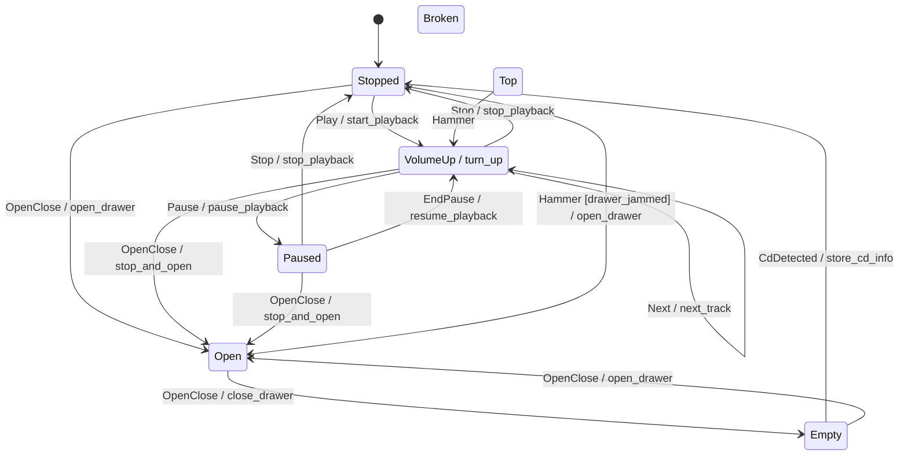

# eta-hsm

[](https://github.com/r4stered/eta-hsm/actions/workflows/linux.yml)
[](https://github.com/r4stered/eta-hsm/actions/workflows/linux.yml)

A C++ library for defining and running **hierarchical state machines** (HSMs).

> **v2 is a clean break.** eta_hsm v2 is a header-only library built on
> **C++26** reflection (P2996). It targets **GCC 16+** and drops the external
> `wise_enum` dependency. The v1 CRTP API is not part of v2 — see
> [Using v1](#using-v1) below to keep building the previous release.

## At a glance

[Compiler Explorer Demo](https://godbolt.org/z/MeT87Eq5a)

A whole machine is one `constexpr` table: States with their parent, the Top
State's Initial Substate, and flat `(Source, Event, Target [, Action])` rows.
There are no handler `switch` bodies and no per-State classes — the topology is
data. Per-State Entry/Exit hooks and Actions are ordinary members of your Host,
matched **by name via reflection**, so you write only the ones you need.

```cpp
#include <cassert>

#include "eta_hsm/machine/hsm.hpp"
#include "eta_hsm/machine/machine.hpp"

using namespace eta_hsm;

enum class State { Top, Stopped, Playing };
enum class Event { Play, Stop };

// The Host owns no machine state; it supplies Actions and per-State hooks.
struct Player {
    int plays = 0;
    void start() { ++plays; }           // an Action, run on a Transition
    void entry_Playing() {}             // a per-State Entry hook, found by reflection
};

// The single source of truth. `Hsm<Player>{}` deduces the State enum from the
// first `.state` and the Event enum from the first `.on`.
inline constexpr auto player = Hsm<Player>{}
                                   .state(State::Stopped, State::Top)
                                   .state(State::Playing, State::Top)
                                   .initial(State::Top, State::Stopped)
                                   .on(State::Stopped, Event::Play, State::Playing, &Player::start)
                                   .on(State::Playing, Event::Stop, State::Stopped);

int main()
{
    Machine<player> m;                          // table validated at compile time; rests in Stopped
    m.dispatch(Event::Play);                    // Stopped -> Playing, runs start()
    assert(m.identify() == State::Playing);
    assert(m.host().plays == 1);
}
```

The same table drives the machine, the compile-time
[validator](#testing), and the [diagram emitter](#diagrams) — one definition,
three consumers, no chance of drift. The data-oriented core has no vtable and no
heap on the event path; see [Performance](#performance).

## Worked examples

Each snippet below is a complete, self-contained program in the style of the one
above, and builds against the real headers via `./docker_build`.

### Guards

A Transition row can carry a Guard: a `bool (Host::*)() const` predicate passed as
the last argument to `.on(...)`. A guarded row fires only when its Guard returns
true; otherwise the Event keeps deferring up the parent chain, exactly as an
unhandled Event does. (This is the `Hammer [drawer_jammed]` row in the
[diagram](#diagrams) below, shown here in miniature.)

```cpp
#include <cassert>

#include "eta_hsm/machine/hsm.hpp"
#include "eta_hsm/machine/machine.hpp"

using namespace eta_hsm;

enum class State { Top, Locked, Open };
enum class Event { Push };

struct Door {
    bool unlocked = false;
    // A Guard is a `bool (Door::*)() const` predicate the row is gated on.
    bool is_unlocked() const { return unlocked; }
    void swing() {}
};

// A guarded row fires only when its Guard returns true; otherwise the Event keeps
// deferring up the parent chain. Push opens the door only when it is unlocked.
inline constexpr auto door =
    Hsm<Door>{}
        .state(State::Locked, State::Top)
        .state(State::Open, State::Top)
        .initial(State::Top, State::Locked)
        .on(State::Locked, Event::Push, State::Open, &Door::swing, &Door::is_unlocked);

int main()
{
    Machine<door> m;             // rests in Locked
    m.dispatch(Event::Push);     // Guard false -> unhandled, no State change
    assert(m.identify() == State::Locked);

    m.host().unlocked = true;
    m.dispatch(Event::Push);     // Guard true -> Locked -> Open
    assert(m.identify() == State::Open);
}
```

### Deeper hierarchy

States nest: each State names its parent, and a Composite names its Initial
Substate. Construction drills from Top down that Initial-Substate chain to the
resting Leaf, firing each Entry hook top-down. An Event the current Leaf does not
handle defers up the parent chain to the nearest ancestor that does — so a parent
can handle an Event on behalf of all its children. On a Transition the Exit hooks
fire bottom-up and the Entry hooks top-down, with the Action in between.

```cpp
#include <cassert>
#include <string>

#include "eta_hsm/machine/hsm.hpp"
#include "eta_hsm/machine/machine.hpp"

using namespace eta_hsm;

// Top
//  |- Active          (Composite, Initial Substate -> Idle)
//  |   |- Idle        (Leaf)
//  |   '- Running     (Leaf)
//  '- Off             (Leaf)
enum class State { Top, Active, Idle, Running, Off };
enum class Event { Start, Shutdown };

struct Engine {
    std::string log;  // records Entry/Exit hooks so the ordered chain is observable
    void entry_Active() { log += "+Active;"; }
    void exit_Active() { log += "-Active;"; }
    void entry_Idle() { log += "+Idle;"; }
    void exit_Idle() { log += "-Idle;"; }
    void entry_Running() { log += "+Running;"; }
    void exit_Running() { log += "-Running;"; }
    void entry_Off() { log += "+Off;"; }
};

inline constexpr auto engine =
    Hsm<Engine>{}
        .state(State::Active, State::Top)
        .state(State::Idle, State::Active)
        .state(State::Running, State::Active)
        .state(State::Off, State::Top)
        .initial(State::Top, State::Active)  // construction drills Top -> Active -> Idle
        .initial(State::Active, State::Idle)
        .on(State::Idle, Event::Start, State::Running)
        // Shutdown is declared on the parent Active, so a child that does not handle
        // it defers up the parent chain to this row.
        .on(State::Active, Event::Shutdown, State::Off);

int main()
{
    Machine<engine> m;  // the Entry chain runs top-down on the way in
    assert(m.host().log == "+Active;+Idle;");
    assert(m.identify() == State::Idle);

    m.host().log.clear();
    m.dispatch(Event::Start);  // Idle -> Running, both under Active (Active stays active)
    assert(m.host().log == "-Idle;+Running;");

    m.host().log.clear();
    m.dispatch(Event::Shutdown);  // Running defers to Active; Exit fires bottom-up
    assert(m.host().log == "-Running;-Active;+Off;");
    assert(m.identify() == State::Off);
}
```

A larger two-level machine — cross-branch Transitions, deferral to an ancestor, and
the External-vs-Local distinction on a parent/child Transition — lives in
[`eta_hsm/examples/nested/nested.hpp`](eta_hsm/examples/nested/nested.hpp).

### Observer / logging

`Machine<Table, Observer>` takes an optional second parameter constrained by the
**`Observer`** concept — a watcher supplying `onEntry` / `onExit` / `onInit` /
`onTransition`. It defaults to a no-op that compiles away to nothing; supply one
and it is notified at each point of the Exit/Action/Entry/init chain, so a logging
layer can render the run without re-deriving the traversal. The bundled
`LoggingObserver` renders each notify into a line via `std::format` and hands it to
a **`Logger`** — a second named concept, satisfied by any sink with a single
`log(std::string_view)` member, so lines can be routed to any backend.
`AutoLoggedMachine` wires the two together: drive it like a Machine and it logs as
it runs.

```cpp
#include <print>
#include <string_view>

#include "eta_hsm/log/auto_logged_machine.hpp"
#include "eta_hsm/machine/hsm.hpp"

using namespace eta_hsm;

enum class State { Top, Stopped, Playing };
enum class Event { Play, Stop };

struct Player {
    void entry_Playing() {}
};

inline constexpr auto player = Hsm<Player>{}
                                   .state(State::Stopped, State::Top)
                                   .state(State::Playing, State::Top)
                                   .initial(State::Top, State::Stopped)
                                   .on(State::Stopped, Event::Play, State::Playing)
                                   .on(State::Playing, Event::Stop, State::Stopped);

// A Logger is any sink with a single `log(std::string_view)` member -- the whole
// contract the `Logger` concept enforces. This one renders each line to stdout.
struct ConsoleLogger {
    void log(std::string_view line) { std::println("{}", line); }
};

int main()
{
    ConsoleLogger logger;
    AutoLoggedMachine<player, ConsoleLogger> m{"cd", logger, /*verbosity=*/1};
    m.dispatch(Event::Play);
    m.dispatch(Event::Stop);
}
```

The Logger sees one finished line per step. At verbosity 1 (Transitions only; 2
adds Entry/Exit, 3 adds init) the run above prints:

```text
cd HSM transitioning from Stopped to Playing due to Play
cd HSM transitioning from Playing to Stopped due to Stop
```

### EventBucket

`EventBucket` queues Events for later draining — `OrderedEventBucket` preserves
insertion order, `PrioritizedEventBucket` orders by enumerator priority (lower
value = higher priority). `getEvent()` removes and returns the next Event as a
`std::optional<Event>`, yielding `std::nullopt` once empty, so a drain loop ends
without any `eNone` sentinel. `PrioritizedEventBucket::top()` peeks the
highest-priority Event without removing it and carries a `pre(!empty())` contract:
peeking an empty bucket traps rather than fabricating a value.

```cpp
#include <cassert>
#include <optional>

#include "eta_hsm/utils/EventBucket.hpp"

using namespace eta_hsm::utils;

// Lower enumerator value == higher priority for the prioritized bucket.
enum class Event { Eject, Play, Stop };

int main()
{
    OrderedEventBucket<Event> queue;
    queue.addEvent(Event::Play);
    queue.addEvent(Event::Stop);

    // Drain: getEvent() yields std::optional<Event>, std::nullopt once empty, so the
    // loop ends with no eNone sentinel to test for. Feed each to a Machine with
    // m.dispatch(*evt).
    while (std::optional<Event> evt = queue.getEvent())
    {
        // m.dispatch(*evt);
        (void)evt;
    }
    assert(queue.empty());

    PrioritizedEventBucket<Event> urgent;
    urgent.addEvent(Event::Stop);
    urgent.addEvent(Event::Eject);         // lower enumerator -> higher priority
    assert(urgent.top() == Event::Eject);  // top() carries pre(!empty()): peeking an
                                           // empty bucket is a contract violation, not a sentinel
    assert(urgent.getEvent() == Event::Eject);
}
```

## Performance

eta_hsm is data-oriented by construction, and the costs that matter are
**structural** — true of *every* machine regardless of size, not a benchmark
number that rots. A `Machine<Table>` is:

- **Zero heap allocation on the event path.** Delivering an Event touches only
  the Host and the machine's single State word; nothing is allocated to dispatch.
- **No virtual dispatch.** The machine carries no vtable and is never
  polymorphic. The transition table is bound as a `constexpr` non-type template
  argument, so dispatch is generated at compile time rather than resolved through
  indirection.
- **A fixed, compile-time-known footprint.** `sizeof(Machine<Table>)` is
  `sizeof(Host)` plus a single State word (modulo alignment) — no per-Transition
  storage, no hidden pointers, no growth with the size of the table.
- **A fully-unrolled linear scan over a `constexpr` table.** Dispatch expands
  (via P1306 expansion statements) to a flat sequence of comparisons over the
  table's Transition rows — the per-level scan is unrolled, with no loop over the
  rows and no function-pointer table walk. An unhandled Event then defers up the
  parent chain — a runtime walk that rescans the rows at each level — so the worst
  case is **O(Transitions × depth)**, not O(depth).

These structural claims are **enforced by tests**, so they cannot silently
regress. `static_assert`s
([`eta_hsm/tests/footprint_test.cpp`](eta_hsm/tests/footprint_test.cpp)) pin the
footprint shape, the trivially-destructible (no-heap-of-its-own) machine, and the
non-polymorphic (no-vtable) property on the `cd_player` table. The two **codegen**
claims — zero heap allocation and no function-pointer table walk on the event
path — are read off the `-O2` disassembly by a CI gate
([`tools/codegen_gate.sh`](tools/codegen_gate.sh)), which fails the build if
`dispatch` grows a heap call or an indirect call.

> **Deliberately no runtime wall-clock benchmark.** A ns/dispatch figure is
> hardware-dependent and ages badly; the structural guarantees above are durable
> and verifiable. Adding a benchmark later is cheap if a consumer needs one.

The runtime **contracts** — the `pre`/`contract_assert` preconditions on
`top()` and `dispatch` — are checked in **every** build, including Release: a
violation aborts cleanly instead of proceeding into undefined behavior. This is
free where it counts — the optimizer eliminates any predicate it can prove, and
against the `constexpr` table it can prove both, so the enforcing and
non-checking machine code come out byte-identical; an unoptimized build keeps the
check but its cost sits below measurement noise. There is no safety-vs-speed dial
to set per build.

### Compile-time scaling

Reflection (P2996) and expansion statements (P1306) are compile-time-heavy, so
the open question is whether the design scales to a large machine's *build*. A
`consteval generate<N, Depth>()` probe
([`tools/scaling_probe.sh`](tools/scaling_probe.sh)) sweeps synthetic N-State
machines and records GCC-16 compile time and peak GC memory. Measured on an
**Apple M5 Pro** under **GCC 16.0.1** in the `eta_hsm-toolchain` Docker image,
**2026-06-05** (reference shape: `-O2`, ~3-deep nesting — closest to a real
build):

| States (N)         | Compile (s) | Peak GGC (MB) |
| -----------------: | ----------: | ------------: |
| 7 (small)          |        0.28 |           139 |
| 45 (large)         |        0.40 |           170 |
| 60 (beyond)        |        0.42 |           186 |

Growth is sub-quadratic: compile time scales as ≈ N^0.2 over 7 → 45, so a
45-State machine costs ~1.4× the compile time and ~1.2× the peak memory of a
7-State one. Re-run
`./docker_build bash tools/scaling_probe.sh` to refresh the numbers on your host.

### Capacity caps

The builder's table storage has two compile-time capacities — `kMaxStates`
(default 64) and `kMaxTransitions` (default 256) — generously sized to hold any
machine in the tree. A consumer with a larger machine raises either ceiling per
translation unit with a `-D`, without editing the library:

```bash
g++ -std=c++26 -freflection -DETA_HSM_MAX_STATES=256 -DETA_HSM_MAX_TRANSITIONS=4096 ...
```

With no override the defaults stand and every machine's table storage, codegen, and
footprint are byte-identical to the fixed-capacity form. The validator's capacity
diagnostics interpolate the live limit, so an over-large machine names the cap
actually in force rather than a stale literal.

### Scaling frontier

How far past the default cap does the design actually reach? A re-runnable sweep
([`tools/scaling_frontier.sh`](tools/scaling_frontier.sh)) emits machines of five
shapes as standalone source, doubles the State count (64 → 128 → 256 → …) to
bracket the first failure, and at each size compiles with the cap raised **and**
runs the emitted machine through the [differential backbone](#differential-verification)
— so correctness is verified at scale, not just compilation. Each shape isolates a
subsystem: a **deep chain** (per-dispatch chain length and path depth), a **wide
star** (`template for` breadth), a **balanced tree** (the realistic middle), a
**dense-transition** machine (the validator's O(transitions²) ambiguity scan), and a
**worst case** stacking all of them.

The frontier is set entirely by that quadratic scan. **Sparse machines — the
realistic case — have large headroom:** the deep, wide, and balanced shapes compile
and verify cleanly to N = 512 (the largest swept), where only GCC's *default* soft
limits would stop a naive user — lifted by cranking `-fconstexpr-ops-limit`, not by
memory. The dense families wall hard: a near-complete transition graph drives
compile memory up roughly as N⁴ and exhausts memory by N = 128. Runtime cost stays a
bounded structural property throughout (max Exit/Entry steps and active-path depth
track the machine's shape), with no wall-clock figure introduced. The harness
classifies every cliff by mode (soft-limit wall vs OOM / ICE / timeout) and writes a
report to `docs/probes/`; re-run it to map the frontier on your host.

## Toolchain

The single supported toolchain is **GCC 16+** at `-std=c++26 -freflection`
(the first GCC line shipping P2996 reflection).

A Docker image pins this toolchain for local builds:

```bash
./docker_build                                    # build the image
# configure, build, and test via the CMake presets (run from the repo root):
./docker_build bash -c 'cmake --preset default && cmake --build --preset default && ctest --preset default'
./docker_build bazel test //...                   # or via Bazel
```

## Build (CMake)

The presets live in [`CMakePresets.json`](CMakePresets.json) and write to a
`build/` directory at the repo root:

```bash
cmake --preset default          # configure
cmake --build --preset default  # build
ctest --preset default          # test
```

A `sanitizer` preset builds the suite under ASan + UBSan (`cmake --preset sanitizer`).

eta_hsm consumes cleanly two ways. Either install it and `find_package`:

```bash
cmake --install build --prefix /your/prefix
```

```cmake
find_package(EtaHsm REQUIRED)
target_link_libraries(your_target PRIVATE EtaHsm::eta_hsm)
```

or pull it straight into your build with `FetchContent` — the repo root is the
CMake root, so no `SOURCE_SUBDIR` workaround is needed and only the interface
target is brought in (no tests, no GoogleTest, no tools):

```cmake
include(FetchContent)
FetchContent_Declare(
  EtaHsm
  GIT_REPOSITORY https://github.com/r4stered/eta-hsm.git
  GIT_TAG v2
)
FetchContent_MakeAvailable(EtaHsm)
target_link_libraries(your_target PRIVATE EtaHsm::eta_hsm)
```

Either way the imported target propagates C++26 and `-freflection`, so consumers
don't set them by hand. Minimal consumers for both paths live in
[`tests/consumer`](tests/consumer) (find_package) and
[`tests/consumer-fetchcontent`](tests/consumer-fetchcontent) (FetchContent); each
builds a real `Machine<>` over the installed `machine/` headers.

## Enum reflection

[`eta_hsm/reflect/enum_reflection.hpp`](eta_hsm/reflect/enum_reflection.hpp)
gives reflection over any plain `enum class` via `std::meta`, replacing
`wise_enum` for name/count/value queries:

```cpp
#include "eta_hsm/reflect/enum_reflection.hpp"

enum class Color { Red, Green, Blue };

eta_hsm::enum_count<Color>();        // 3
eta_hsm::enum_values<Color>();       // std::array<Color, 3>, declaration order
eta_hsm::enum_name(Color::Red);      // std::optional{"Red"}
eta_hsm::enum_name((Color)99);       // std::nullopt
```

All three are usable in `constexpr`/`consteval` contexts; sentinel enumerators
(e.g. `eNone`/`eTop`) are reported like any other.

## Diagrams

A machine *is* its `constexpr` table, so its diagram is generated by walking that
table — the single source of truth — rather than scraping source. State nesting
comes from the table topology; Transition labels carry the exact Event, Guard, and
Action names, recovered via reflection (`std::meta::identifier_of`). Include a
machine's header and call `eta_hsm::diagram::to_plantuml<table>()` or
`to_mermaid<table>()`; the [`cd_player_diagram`](eta_hsm/diagram/cd_player_diagram_main.cpp)
tool prints either form:

```bash
cmake --build build --target cd_player_diagram
./build/cd_player_diagram             # PlantUML
./build/cd_player_diagram --mermaid   # Mermaid
```

The cd_player machine renders as (this block is regenerated from the emitter and a
test keeps it in sync with the machine):



## Build (Bazel)

```bash
bazel test //...
```

`bazel build //eta_hsm:eta_hsm` gives the header-only library target.

## Testing

Tests use **GoogleTest** only. The reflection smoke test
([`eta_hsm/tests/reflection_smoke_test.cpp`](eta_hsm/tests/reflection_smoke_test.cpp))
proves the toolchain compiles and runs P2996 reflection under both build
systems, and
[`enum_reflection_test.cpp`](eta_hsm/tests/enum_reflection_test.cpp)
covers the public enum reflection utility (names, counts, values, sentinels,
non-`int` underlying types, and compile-time use).

### Differential verification

Beyond the unit suite, the machine is checked against an independent **reference
interpreter** — a deliberately naive oracle that walks a runtime view of the same
`constexpr` table. Production dispatch is asserted to agree with it on the resting
Leaf and the full Exit/Action/Entry transcript, with no hand-authored expected
strings — every expectation is computed from the table:

```cpp
#include <cassert>

#include "eta_hsm/examples/cd_player/cd_player.hpp"
#include "eta_hsm/machine/machine.hpp"
#include "eta_hsm/reference/reference_interpreter.hpp"

using namespace eta_hsm::examples::cd_player;
using eta_hsm::Machine;
using eta_hsm::reference::makeTableView;
using eta_hsm::reference::referenceStep;
using eta_hsm::reference::renderOn;

int main()
{
    // The reference interpreter is a naive, independent oracle: it walks a runtime
    // view of the same constexpr table. Production dispatch is asserted to agree.
    static const auto view = makeTableView<player>();
    Player const host{};

    // Reference: the expected resting Leaf and Exit/Action/Entry transcript.
    auto const plan = referenceStep(view, State::Stopped, Event::Play, host);

    // Production: drive the live Machine through the same step.
    Machine<player> m;
    m.host().log.clear();  // drop the construction-time Entry chain
    m.dispatch(Event::Play);

    assert(m.identify() == plan.leaf);           // Playing
    assert(m.host().log == renderOn(plan).log);  // "-Stopped;start_playback;+Playing;"
}
```

This single step is the seed of a generative harness built on the same oracle: an
exhaustive BFS over every reachable `(State, Event)`
([`reference/backbone.hpp`](eta_hsm/reference/backbone.hpp)) and a seeded
random-walk differential with a bisect shrinker that minimizes any divergence to
its smallest reproducing Event sequence
([`reference/random_walk.hpp`](eta_hsm/reference/random_walk.hpp)), both layered on
[`reference/reference_interpreter.hpp`](eta_hsm/reference/reference_interpreter.hpp).

## Linting & formatting

CI runs two lint gates — `cpp_linting`, `cmake_format`
(`.github/workflows/linux.yml`); buildifier runs as a local pre-commit hook.
Reproduce them with the **same tools the pipeline pins** — these are
formatters/linters, not the compiler, so they run on the host, *not* in the
toolchain image.

### Run all gates

```bash
./tools/lint.sh
```

This runs `cmake_format` and `cpp_linting` with the exact
versions CI pins. On the first run it builds a cached, git-ignored venv
(`tools/.lintenv`) and reuses it afterward, so repeat runs do no install work; it
rebuilds only when the pins in the script change. A non-zero exit (with a diff)
means that gate would fail CI.

This does not cover the Bazel `buildifier` hook (pre-commit only, not a CI gate);
run `pre-commit run --all-files` if you've touched `BUILD`/`*.bazel` files.

### Individual gates

**CMake + Bazel formatting** — via pre-commit, which pins the exact versions CI
uses (`gersemi==0.27.7`, `buildifier 7.3.1.2`):

```bash
pip install pre-commit
pre-commit run --all-files          # gersemi (cmake_format job) + buildifier
```

Or run gersemi directly, exactly as the `cmake_format` job does:

```bash
gersemi --check eta_hsm tests/consumer
```

**C++ formatting** (`cpp_linting` job) — clang-format **21** (older versions
mangle the C++26 reflection `^^` syntax):

```bash
# macOS: brew install clang-format   (or: pip install 'clang-format==21.*')
clang-format --version              # must report 21.x
find eta_hsm \( -name '*.hpp' -o -name '*.cpp' \) -print0 \
  | xargs -0 clang-format --dry-run --Werror
```

To **auto-fix** rather than check: `pre-commit run --all-files` rewrites the
CMake/Bazel files in place, and `clang-format -i <files>` rewrites C++.

## Using v1

v1 (the C++17, `wise_enum`-based CRTP API) remains available from its tags.
Pin the latest v1 release:

```
# CMake (FetchContent) / Bazel (git_repository): use tag v1.1.2
git checkout v1.1.2
```

v1 consumers keep building against `v1.1.2` until they migrate to the v2 table
API. v1 is not maintained on `main`.
