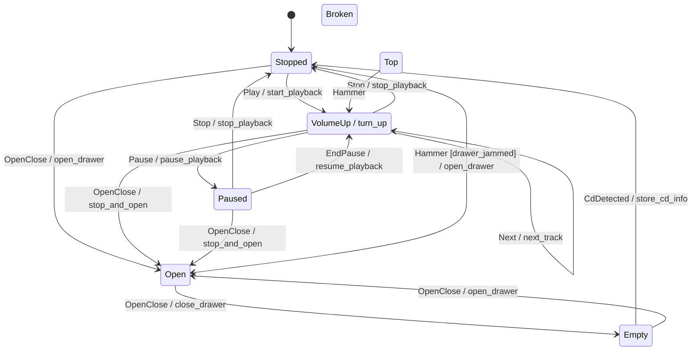

# eta-hsm

A C++ library for defining and running **hierarchical state machines** (HSMs).

> **v2 is a clean break.** eta_hsm v2 is a header-only library built on
> **C++26** reflection (P2996). It targets **GCC 16+** and drops the external
> `wise_enum` dependency. The v1 CRTP API is not part of v2 — see
> [Using v1](#using-v1) below to keep building the previous release.

## At a glance

A whole machine is one `constexpr` table: States with their parent, the Top
State's Initial Substate, and flat `(Source, Event, Target [, Action])` rows.
There are no handler `switch` bodies and no per-State classes — the topology is
data. Per-State Entry/Exit hooks and Actions are ordinary members of your Host,
matched **by name via reflection**, so you write only the ones you need.

```cpp
#include <cassert>

#include "eta_hsm/machine/hsm.hpp"
#include "eta_hsm/machine/machine.hpp"

using namespace eta_hsm;

enum class State { Top, Stopped, Playing };
enum class Event { Play, Stop };

// The Host owns no machine state; it supplies Actions and per-State hooks.
struct Player {
    int plays = 0;
    void start() { ++plays; }           // an Action, run on a Transition
    void entry_Playing() {}             // a per-State Entry hook, found by reflection
};

// The single source of truth. `Hsm<Player>{}` deduces the State enum from the
// first `.state` and the Event enum from the first `.on`.
inline constexpr auto player = Hsm<Player>{}
                                   .state(State::Stopped, State::Top)
                                   .state(State::Playing, State::Top)
                                   .initial(State::Top, State::Stopped)
                                   .on(State::Stopped, Event::Play, State::Playing, &Player::start)
                                   .on(State::Playing, Event::Stop, State::Stopped);

int main()
{
    Machine<player> m;                          // table validated at compile time; rests in Stopped
    m.dispatch(Event::Play);                    // Stopped -> Playing, runs start()
    assert(m.identify() == State::Playing);
    assert(m.host().plays == 1);
}
```

The same table drives the machine, the compile-time
[validator](#testing), and the [diagram emitter](#diagrams) — one definition,
three consumers, no chance of drift. The data-oriented core has no vtable and no
heap on the event path; see [Performance](#performance).

## Performance

eta_hsm is data-oriented by construction, and the costs that matter are
**structural** — true of *every* machine regardless of size, not a benchmark
number that rots. A `Machine<Table>` is:

- **Zero heap allocation on the event path.** Delivering an Event touches only
  the Host and the machine's single State word; nothing is allocated to dispatch.
- **No virtual dispatch.** The machine carries no vtable and is never
  polymorphic. The transition table is bound as a `constexpr` non-type template
  argument, so dispatch is generated at compile time rather than resolved through
  indirection.
- **A fixed, compile-time-known footprint.** `sizeof(Machine<Table>)` is
  `sizeof(Host)` plus a single State word (modulo alignment) — no per-Transition
  storage, no hidden pointers, no growth with the size of the table.
- **A fully-unrolled linear scan over a `constexpr` table.** Dispatch expands
  (via P1306 expansion statements) to a flat sequence of comparisons over the
  table's Transition rows — no loop over runtime data, no function-pointer table
  walk. An unhandled Event defers up the parent chain, rescanning the rows at each
  level, so the worst case is **O(Transitions × depth)** — not O(depth).

These structural claims are **enforced by tests**
([`eta_hsm/tests/footprint_test.cpp`](eta_hsm/tests/footprint_test.cpp)):
`static_assert`s pin the footprint shape, the trivially-destructible
(no-heap-of-its-own) machine, and the non-polymorphic (no-vtable) property on the
`cd_player` table, so they cannot silently regress.

> **Deliberately no runtime wall-clock benchmark.** A ns/dispatch figure is
> hardware-dependent and ages badly; the structural guarantees above are durable
> and verifiable. Adding a benchmark later is cheap if a consumer needs one.

### Compile-time scaling

Reflection (P2996) and expansion statements (P1306) are compile-time-heavy, so
the open question is whether the design scales to a large machine's *build*. A
`consteval generate<N, Depth>()` probe
([`tools/scaling_probe.sh`](tools/scaling_probe.sh)) sweeps synthetic N-State
machines and records GCC-16 compile time and peak GC memory. Measured on an
**Apple M5 Pro** under **GCC 16.0.1** in the `eta_hsm-toolchain` Docker image,
**2026-06-05** (reference shape: `-O2`, ~3-deep nesting — closest to a real
build):

| States (N)         | Compile (s) | Peak GGC (MB) |
| -----------------: | ----------: | ------------: |
| 7 (small)          |        0.28 |           139 |
| 45 (large)         |        0.40 |           170 |
| 60 (beyond)        |        0.42 |           186 |

Growth is sub-quadratic: compile time scales as ≈ N^0.2 over 7 → 45, so a
45-State machine costs ~1.4× the compile time and ~1.2× the peak memory of a
7-State one. Re-run
`./docker_build bash tools/scaling_probe.sh` to refresh the numbers on your host.

## Toolchain

The single supported toolchain is **GCC 16+** at `-std=c++26 -freflection`
(the first GCC line shipping P2996 reflection).

A Docker image pins this toolchain for local builds:

```bash
./docker_build                                    # build the image
./docker_build cmake -S eta_hsm -B build -G Ninja # configure
./docker_build cmake --build build                # build
./docker_build ctest --test-dir build --output-on-failure
./docker_build bazel test //...                   # or via Bazel
```

## Build (CMake)

```bash
cmake -S eta_hsm -B build -G Ninja
cmake --build build
ctest --test-dir build --output-on-failure
```

eta_hsm installs as a header-only package with a `find_package` export:

```bash
cmake --install build --prefix /your/prefix
```

```cmake
find_package(EtaHsm REQUIRED)
target_link_libraries(your_target PRIVATE EtaHsm::eta_hsm)
```

The imported target propagates C++26 and `-freflection`, so consumers don't
set them by hand. A minimal consumer lives in [`tests/consumer`](tests/consumer).

## Enum reflection

[`eta_hsm/reflect/enum_reflection.hpp`](eta_hsm/reflect/enum_reflection.hpp)
gives reflection over any plain `enum class` via `std::meta`, replacing
`wise_enum` for name/count/value queries:

```cpp
#include "eta_hsm/reflect/enum_reflection.hpp"

enum class Color { Red, Green, Blue };

eta_hsm::enum_count<Color>();        // 3
eta_hsm::enum_values<Color>();       // std::array<Color, 3>, declaration order
eta_hsm::enum_name(Color::Red);      // std::optional{"Red"}
eta_hsm::enum_name((Color)99);       // std::nullopt
```

All three are usable in `constexpr`/`consteval` contexts; sentinel enumerators
(e.g. `eNone`/`eTop`) are reported like any other.

## Diagrams

A machine *is* its `constexpr` table, so its diagram is generated by walking that
table — the single source of truth — rather than scraping source. State nesting
comes from the table topology; Transition labels carry the exact Event, Guard, and
Action names, recovered via reflection (`std::meta::identifier_of`). Include a
machine's header and call `eta_hsm::diagram::to_plantuml<table>()` or
`to_mermaid<table>()`; the [`cd_player_diagram`](eta_hsm/diagram/cd_player_diagram_main.cpp)
tool prints either form:

```bash
cmake --build build --target cd_player_diagram
./build/cd_player_diagram             # PlantUML
./build/cd_player_diagram --mermaid   # Mermaid
```

The cd_player machine renders as (this block is regenerated from the emitter and a
test keeps it in sync with the machine):



## Build (Bazel)

```bash
bazel test //...
```

`bazel build //eta_hsm:eta_hsm` gives the header-only library target.

## Testing

Tests use **GoogleTest** only. The reflection smoke test
([`eta_hsm/tests/reflection_smoke_test.cpp`](eta_hsm/tests/reflection_smoke_test.cpp))
proves the toolchain compiles and runs P2996 reflection under both build
systems, and
[`enum_reflection_test.cpp`](eta_hsm/tests/enum_reflection_test.cpp)
covers the public enum reflection utility (names, counts, values, sentinels,
non-`int` underlying types, and compile-time use).

## Linting & formatting

CI runs two lint gates — `cpp_linting`, `cmake_format`
(`.github/workflows/linux.yml`); buildifier runs as a local pre-commit hook.
Reproduce them with the **same tools the pipeline pins** — these are
formatters/linters, not the compiler, so they run on the host, *not* in the
toolchain image.

### Run all gates

```bash
./tools/lint.sh
```

This runs `cmake_format` and `cpp_linting` with the exact
versions CI pins. On the first run it builds a cached, git-ignored venv
(`tools/.lintenv`) and reuses it afterward, so repeat runs do no install work; it
rebuilds only when the pins in the script change. A non-zero exit (with a diff)
means that gate would fail CI.

This does not cover the Bazel `buildifier` hook (pre-commit only, not a CI gate);
run `pre-commit run --all-files` if you've touched `BUILD`/`*.bazel` files.

### Individual gates

**CMake + Bazel formatting** — via pre-commit, which pins the exact versions CI
uses (`gersemi==0.27.7`, `buildifier 7.3.1.2`):

```bash
pip install pre-commit
pre-commit run --all-files          # gersemi (cmake_format job) + buildifier
```

Or run gersemi directly, exactly as the `cmake_format` job does:

```bash
gersemi --check eta_hsm tests/consumer
```

**C++ formatting** (`cpp_linting` job) — clang-format **21** (older versions
mangle the C++26 reflection `^^` syntax):

```bash
# macOS: brew install clang-format   (or: pip install 'clang-format==21.*')
clang-format --version              # must report 21.x
find eta_hsm \( -name '*.hpp' -o -name '*.cpp' \) -print0 \
  | xargs -0 clang-format --dry-run --Werror
```

To **auto-fix** rather than check: `pre-commit run --all-files` rewrites the
CMake/Bazel files in place, and `clang-format -i <files>` rewrites C++.

## Using v1

v1 (the C++17, `wise_enum`-based CRTP API) remains available from its tags.
Pin the latest v1 release:

```
# CMake (FetchContent) / Bazel (git_repository): use tag v1.1.2
git checkout v1.1.2
```

v1 consumers keep building against `v1.1.2` until they migrate to the v2 table
API. v1 is not maintained on `main`.
